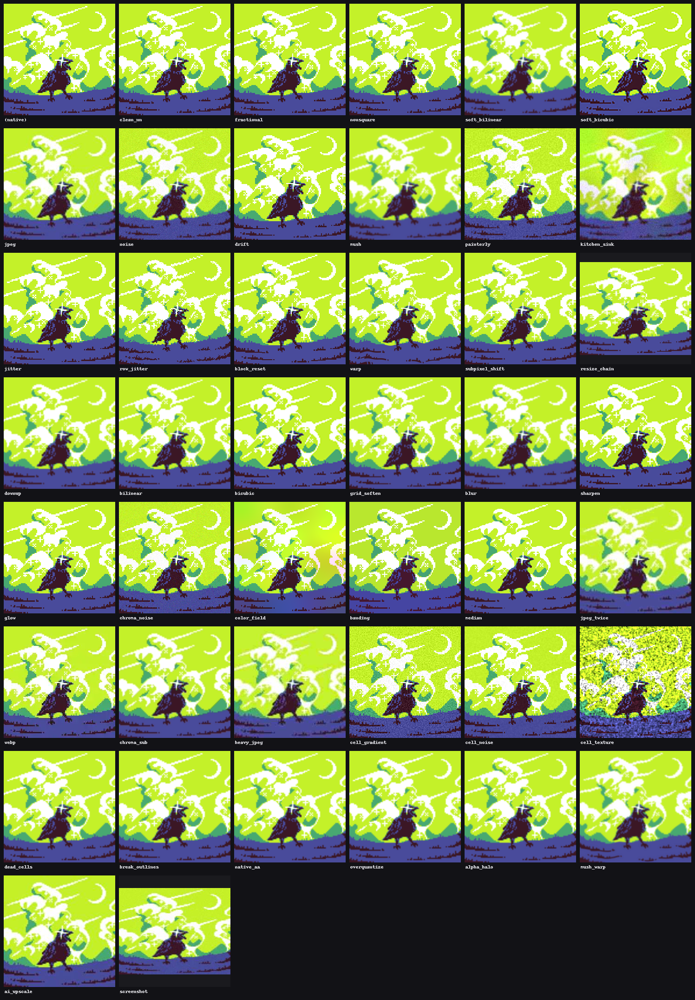

# Distortion suite v1

pixel-bench turns clean native (1x) pixel art into the kind of fake pixel art
that shows up in the wild, then asks each method to recover the original. The
damage is organized into a fixed, versioned set of named **categories**. Each
category is a deterministic function of the source image: the spec for a given
`(image, category)` is derived from a hash of the image filename, the category
name, and the suite version, so everyone running suite v1 on the same image
gets a byte-identical distorted input. Results are therefore comparable and
citable across users and across time.

A `--severity` scalar (default `1.0`) multiplies the damage amplitudes for
easier/harsher variants. The **upscale factor is severity-independent** so the
core size-recovery task stays constant; severity only turns the photometric and
geometric damage up or down.

> **Stability rule.** Categories are append-only within a suite version. An
> existing category's parameters are never changed silently - that would break
> comparability. New or changed behavior ships as a new category or a new suite
> version (`v2`, ...).

Render the whole suite on one of your own images to see what it does:

```bash
pixelbench preview --image my_art.png --out preview.png
```



## The categories

Suite v1 has **43** categories. Most are *isolates* that apply a single
distortion so you can see exactly which damage each method fails on; the rest
are realistic *combinations* that stack several. Every category still applies an
upscale (that is the core fake-pixel-art task); the named effect is what varies.

**Geometry / grid**

| Category | What it simulates |
|---|---|
| `clean_nn` | Integer nearest-neighbour upscale, no photometric damage. The floor case. |
| `fractional` | Non-integer **square** upscale (nearest). Cells are uneven integer widths. |
| `nonsquare` | Independent horizontal and vertical scales. Breaks square-factor assumptions. |
| `drift` | The cell size smoothly grows and shrinks across the image (non-uniform grid). |
| `jitter` | Every cell edge is offset a little (per-cut grid jitter). |
| `row_jitter` | Whole native rows/columns shifted independently. |
| `block_reset` | Image split into blocks, each with its own grid phase (sprite-sheet stitch). |
| `warp` | Smooth sinusoidal geometric warp of the grid. |
| `subpixel_shift` | A constant fractional-pixel offset (ghosted composite). |
| `resize_chain` | Several successive resizes at random filters and non-integer factors. |
| `downup` | Downscaled then upscaled again (a bilinear round trip). |

**Resampling kernels**

| Category | What it simulates |
|---|---|
| `bilinear` | Pure bilinear upscale (smeared grid). |
| `bicubic` | Pure bicubic upscale (edge ringing). |
| `soft_bilinear` | Bilinear plus light blur. |
| `soft_bicubic` | Bicubic with unsharp-mask halos. |
| `grid_soften` | An uneven grid resampled with a smooth filter. |

**Photometric**

| Category | What it simulates |
|---|---|
| `blur` | Gaussian blur only. |
| `sharpen` | Unsharp-mask halos only. |
| `glow` | Additive bloom from bright pixels. |
| `noise` | Luma and chroma noise plus slight blur. |
| `chroma_noise` | Per-channel colour noise. |
| `color_field` | Low-frequency per-channel colour cast. |
| `banding` | Posterization to few levels per channel. |
| `median` | 3x3 median filter (denoise-app look). |

**Codec**

| Category | What it simulates |
|---|---|
| `jpeg` | JPEG recompression. |
| `jpeg_twice` | Double JPEG compression. |
| `heavy_jpeg` | Very low quality, double-compressed JPEG. |
| `webp` | WebP re-encoding (different chroma smear from JPEG). |
| `chroma_sub` | 4:2:0 chroma subsampling (video-codec colour smear). |

**In-cell / painterly texture**

| Category | What it simulates |
|---|---|
| `cell_gradient` | Each pseudo-cell gets an internal shading gradient. |
| `cell_noise` | Sub-cell blob noise inside each cell. |
| `cell_texture` | Real-texture infusion inside cells (painterly AI-render look). |
| `painterly` | Large pseudo-cells with internal gradient and blob texture. |

**Native-art damage** (the damage is baked into the 1x art before upscaling, so
the damaged native is the ground truth the method must reproduce)

| Category | What it simulates |
|---|---|
| `dead_cells` | Scattered single wrong-coloured native pixels. |
| `break_outlines` | Short gaps punched into contour lines (fill bleeds through). |
| `native_aa` | The native art is anti-aliased (soft edges). |
| `overquantize` | The native palette is crushed to fewer colours. |
| `alpha_halo` | Bad-composite fringe around the subject. |

**Realistic combinations**

| Category | What it simulates |
|---|---|
| `mush` | AI-upscaler "mush": sub-cell displacement and soft focus over a bilinear grid. |
| `mush_warp` | Mush plus geometric warp (heavy melt). |
| `ai_upscale` | The classic AI-upscaler look: soft, sharpened, glowing, lightly JPEG'd. |
| `screenshot` | Screenshot-of-a-screenshot: resize chain, noise and JPEG. |
| `kitchen_sink` | Everything at once at high severity. |

## Ground truth

The engine returns, for every output pixel, the exact continuous source
coordinate it came from (`U` horizontally, `V` vertically, in native pixel
units). Integer crossings of `U`/`V` are the true pixel-grid cut positions. This
is dense, exact ground truth: it fixes the true native size **and** the true
grid line positions, which is what the `grid_align` metric scores against (see
[METRICS.md](METRICS.md)). Photometric damage (blur, noise, jpeg, ...) leaves
`U`/`V` untouched; only geometry (scale, drift, warp, mush) moves them.

## Adding a category

Append a `Category(name, description, factory)` to `CATEGORIES` in
`pixelbench/distort/suite.py`. The factory is `(rng, severity) -> DistortSpec`
using fields from `pixelbench/distort/engine.py`. Keep it append-only, or bump
`SUITE_VERSION`.
